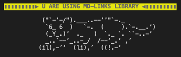
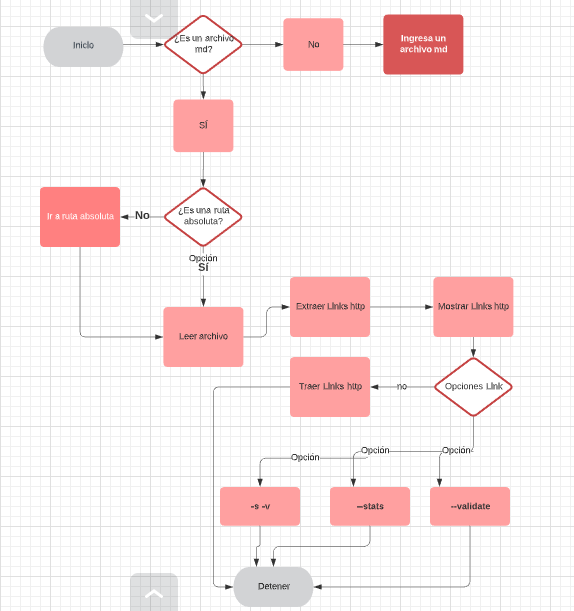
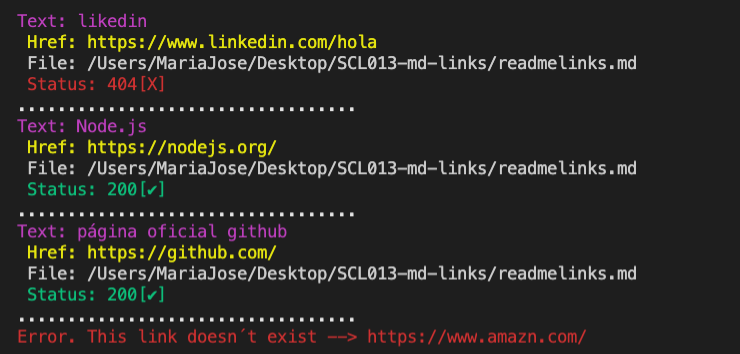

# Markdown Links :computer:

### 1. Preámbulo

Los archivos Markdown normalmente contienen links (vínculos/ligas) que muchas veces están rotos o ya no son válidos y eso perjudica mucho el valor de la información que se quiere compartir.

Esta librería se encargar de leer y analizar los archivos en formato Markdown, para verificar los links que contengan y reportar algunas estadísticas como ver los links totales, los únicos y los que estan rotos.

## 3. Resumen de proyecto
La lógica de este programa la podemos observar en el diagrama a continuación:

## 4. Diagrama de flujo

## 5. Instalacion

## 6. Modo de Uso

Para hacer uso de la librería ejecuta el siguiente comando en la terminal de tu archivo, entregando la ruta de tu archivo.

`*$ node \path\ md-links*`

Para ver el total de links y total de links únicos ejecuta el siguiente comando en la terminal.

`*$ node \path\ -validate o -v*`

Tus consola se verá así:

**Mostrará el status 200 y 404.**
**200**: La solicitud ha tenido éxito.
**404**: NOT FOUND. El servidor no pudo encontrar el contenido solicitado

## 7. Autoras

Maria Jose Garrido y Dalia Garcia

